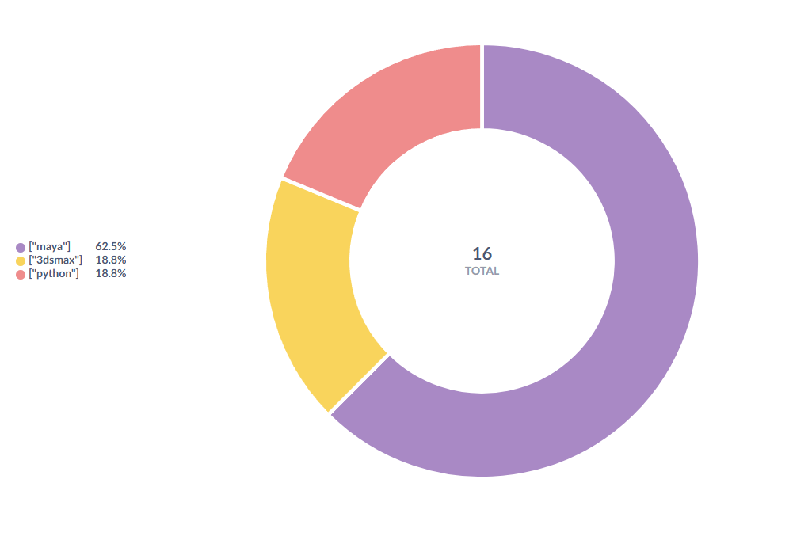

> [!CAUTION]
> This project is highly WIP and expected to change quite a bit (and break easily)

# Rez development and testing sandbox

This project aims to provide a low barrier entry to trying rez - including optional
services like memcached and amqp - and getting a development and testing sandbox.

# Quickstart


## Build the consumer image and bring up all services

The image of the custom consumer is automatically build through docker compose.
The following command should both build and bring all services online in order.

```
docker compose -d --build up
```

## Configure rez
To configure rez to use memcached and emit events on resolve add the rezconfig.py
provided to `REZ_CONFIG_PATH` :

### Windows Powershell
```
$env:REZ_CONFIG_FILE="$pwd\config\rezconfig.py;$env:REZ_CONFIG_FILE"
```

### Windows CMD
```
set REZ_CONFIG_FILE=%cd%\config\rezconfig.py;%REZ_CONFIG_FILE%
```

### Linux and Mac
```
export REZ_CONFIG_FILE="$(pwd)/config/rezconfig.py:$REZ_CONFIG_FILE"
```

## Linuux


# Contents

This project contains the following ready to use components. All services are
deployed as docker containers in a docker compose setup. A custom rezconfig.py
is provided to use with your existing rez setup. rez itself is currently NOT
part of the project.

> [!WARNING]
> Never use this in production. It is meant as a quick and easy way to get a
> a working test setup, nothing more.

## Caching with memcached

A standard memcached setup is provided and configured in the also included
rezconfig.py. You can inspect what exactly happens and if it works by setting
`REZ_DEBUG_MEMCACHE=1`

Caching includes directory traversals, package definitions, resolves for example.


## Context tracking with RabbitMQ, PostgreSQL and a basic consumer service

rez supports publishing resolve information to any AMQP compatible message queue.
RabbitMQ is used in this setup. To persist the published events a custom consumer
service is provided that stores the event data into the also included Postgres
database.

The current setup does not do a lot of normalization and stores the event data
as emitted by rez into a json column.


## pgadmin

A connected pgadmin instance is spun up to allow for easy inspection of the
data in the provided postgres instance


## Charting and analytics with metabase

Metabase is being deployed to allow for easy analytics and dashboards with the
data emitted and persisted.

> [!NOTE]
> Currently the connection to the postgres database needs to be setup manually
> in the GUI of metabase. This might be automated in the future, and if we can
> we will try to provide some sample charts and dashboards.


